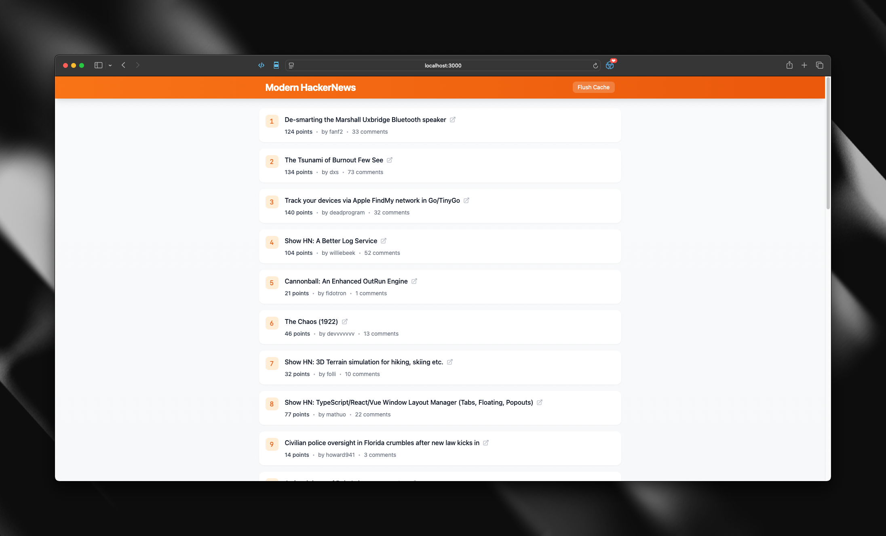

# Modern HackerNews

A modern, real-time HackerNews client built with React and Skrape.ai. Features a clean UI, real-time updates, and persistent storage.

## Features

- 🚀 Real-time HackerNews stories
- 💾 Persistent storage
- 🎨 Modern UI with Tailwind CSS
- 🔄 Automatic refresh every 5 minutes
- 📱 Responsive design

## Prerequisites

- [Bun](https://bun.sh) installed on your system
- [Skrape.ai](https://skrape.ai) API key

## Setup

1. Clone the repository
2. Install the dependencies:
