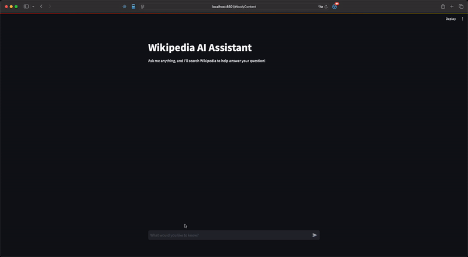

# Wikipedia AI Assistant

A Streamlit-based chat interface that uses Groq's LLM to answer questions based on Wikipedia content. Uses Skrape.ai to convert Wikipedia pages to markdown for better AI processing.



## Setup

1. Create a `.env` file in the project root with your API keys:

```bash
GROQ_API_KEY=your_groq_api_key_here
SKRAPE_API_KEY=your_skrape_api_key_here
```

1. Install dependencies:

```bash
pip install -r requirements.txt
```

1. Run the application:

```bash
streamlit run app.py
```

## Usage

1. Enter your question in the chat input
2. The app will:
   - Search Wikipedia for relevant articles
   - Convert the Wikipedia page to markdown using Skrape.ai
   - Use Groq's LLM to generate a response based on the markdown content
3. The chat history is maintained during your session

## Features

- Real-time Wikipedia search
- HTML to Markdown conversion using Skrape.ai
- Chat interface with message history
- AI-powered responses using Groq's LLM
- Markdown support for better readability
